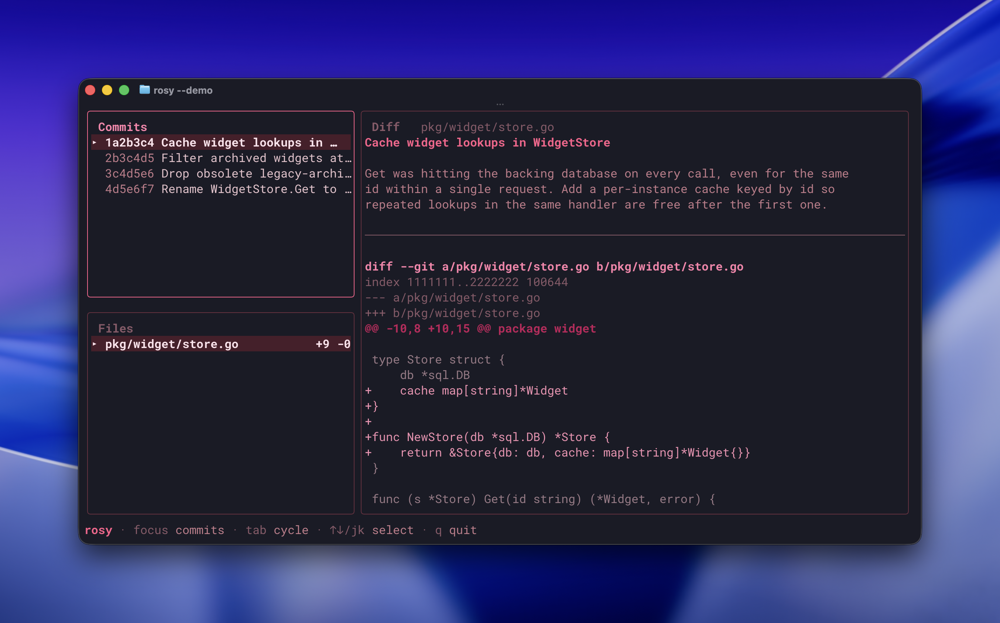

# rosy

> *They say never rewrite history. They haven't seen my commit messages.*

`rosy` looks at a GitHub PR through rose-colored glasses and asks Claude 
to redraft its commit history into what probably *should* have happened.

The output is just for display in a pretty TUI, not an actual git rewrite!
That would be crazy...

*(Unless you press `i`.)*



## Install

```bash
brew install zhubert/tap/rosy
```

Or, if you prefer the Go way:

```bash
go install github.com/zhubert/rosy@latest
```

`rosy` shells out to two tools that must already be on your PATH:

- [`gh`](https://cli.github.com/) — authenticated (`gh auth login`)
- [`claude`](https://claude.com/claude-code) — Anthropic's Claude Code CLI

## Usage

```bash
rosy https://github.com/owner/repo/pull/123
```

## On the occasional embellishment

The reconstruction is line-for-line faithful by contract: every added
line in the PR must appear exactly once across the fabricated commits,
same for removed lines. A deterministic post-check enforces this.

When the muse drifts — duplicating a hunk across two commits, or
inventing a stray line of its own — `rosy` flags the divergence in
crimson and opens the TUI anyway. This is a fun project, not a court
record. Trust the diffs; treat the prose as a suggestion.

## License

MIT.
